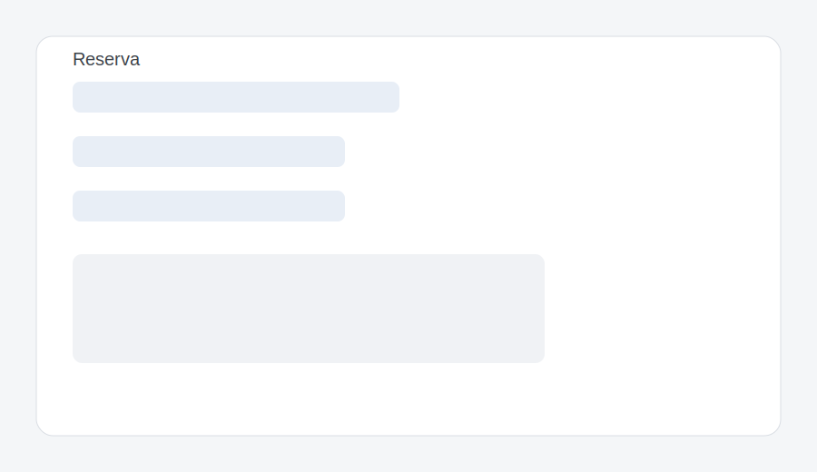
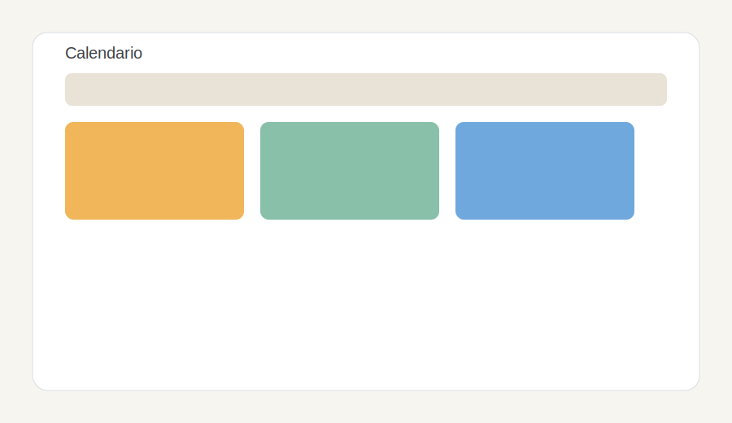

# Reservas de Aulas y Recursos (school_booking)

Modulo para gestionar aulas y reservas con control de solapes, aprobacion y calendario.

## Instalacion
1. Copia el modulo en `customs_addons/`.
2. Reinicia Odoo.
3. Actualiza la lista de aplicaciones.
4. Instala **Evaristo: Reservas de Aulas y Recursos**.

## Configuracion inicial
1. Entra con un usuario interno.
2. Ve a `Escuela > Aulas` y crea al menos un aula/recurso.
3. (Opcional) Asigna el grupo `Reservas de Aulas - Manager` a quien deba ver todas las reservas.

## Uso completo
### Como reservar un aula
1. Ve a `Escuela > Reservas de Aula`.
2. Pulsa **Crear**.
3. Selecciona el `Aula/Recurso`.
4. Define `Inicio` y `Fin`.
5. (Opcional) Escribe `Notas`.
6. Guarda la reserva.
7. Si requiere aprobacion, pulsa **Enviar a aprobacion**.
8. Un manager puede **Aprobar** o **Rechazar** con motivo.

### Crear un aula
1. Menu `Escuela > Aulas`.
2. Pulsa **Crear**.
3. Completa `Nombre`, `Capacidad`, `Ubicacion` y guarda.

### Crear una reserva
1. Menu `Escuela > Reservas de Aula`.
2. Pulsa **Crear**.
3. Selecciona `Aula/Recurso`, `Inicio` y `Fin`.
4. (Opcional) Anade `Notas`.
5. Guarda.

### Flujo de estados
- **Borrador**: reserva creada.
- **Esperando aprobacion**: usa **Enviar a aprobacion**.
- **Confirmada**: usa **Aprobar**.
- **Rechazada**: usa **Rechazar** e indica motivo.
- **Cancelada**: usa **Cancelar**.

### Rechazar con motivo (wizard)
1. Abre una reserva en estado **Esperando aprobacion**.
2. Pulsa **Rechazar**.
3. Escribe el motivo y confirma.

### Ver calendario
1. En `Escuela > Reservas de Aula` cambia la vista a **Calendario**.
2. Las reservas se muestran por aula y fecha.

### Permisos
- Usuarios internos pueden crear y gestionar sus reservas.
- Managers pueden ver y gestionar todas las reservas.

## Funcionalidades
- Control de solapes por aula.
- Duracion calculada.
- Estados con botones y statusbar.
- Chatter y actividades (mail.thread).
- Asistente de rechazo con motivo.
- Vista calendario.

## Capturas

